## <a id="GetCCEJwks">一. 获取CCE集群的签名公钥</a>

1. 登录CCE节点，并使用kubectl连接集群。
2. 执行如下命令获取公钥。
```bash
kubectl get --raw /openid/v1/jwks
```
返回的结果即集群的公钥，回显结果示例如下：
```bash
# kubectl get --raw /openid/v1/jwks
{"keys":[{"use":"sig","kty":"RSA","kid":"*****","alg":"RS256","n":"*****","e":"AQAB"}]}
```
## <a id="CreateSa">二. 创建ServiceAccount</a>
1. 执行以下命令，创建ServiceAccount
```
kubectl  create sa oidc-token
```
注：oidc-token为ServiceAccount名称，后续**创建身份提供商**和**挂载身份提供商**均会用到

## <a id="CreateIamIdentityProvider">三. 在IAM创建身份提供商</a>

1. 登录IAM控制台，在左侧导航栏选择“身份提供商”，在右上角单击“创建身份提供商”。

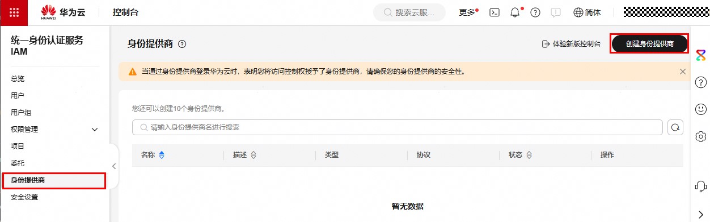

协议选择**OpenID Connect**，类型选择**虚拟用户SSO**，单击**确定**。

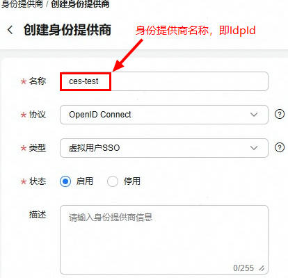

2. 在身份提供商列表中找到新增的身份提供商，在操作列单击**修改**，修改身份提供商信息。

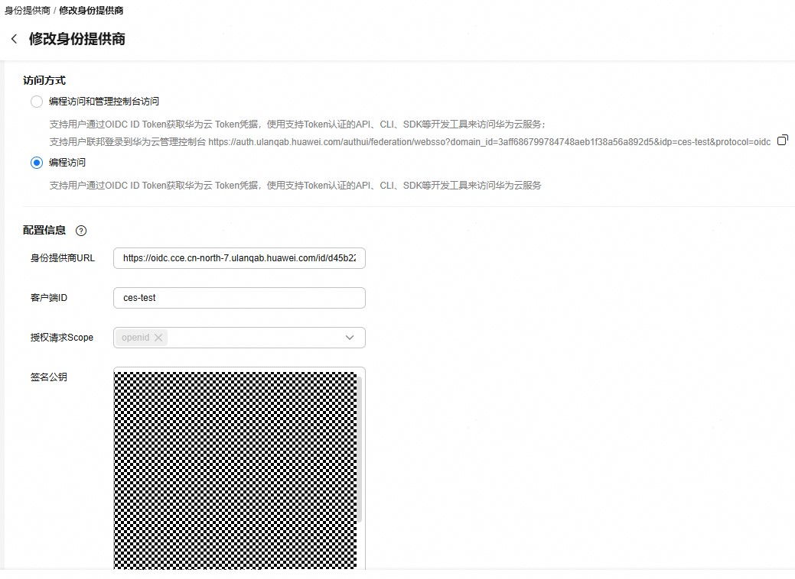

   **访问方式**：选择**编程访问**。<br>

   **身份提供商URL**：集群默认的身份提供商为 https://kubernetes.default.svc.cluster.local；如果集群“概览 > 连接信息”中开启了“OpenID Connect 提供商”功能，则可前往集群“配置中心 > Kubernetes原生配置”中的“服务账户令牌发行者 (service-account-issuer)”配置获取身份提供商URL。<br>

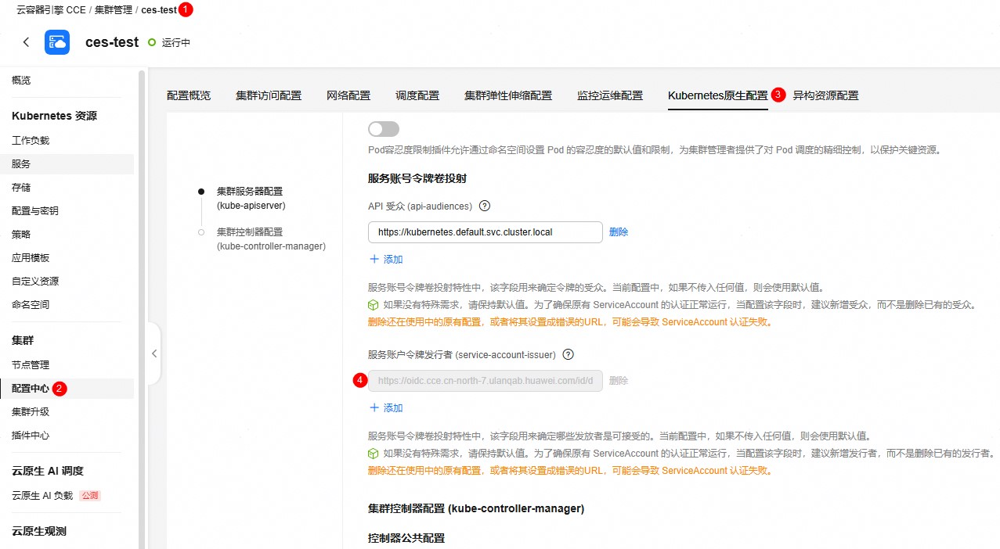
   
   **客户端ID**：填写一个ID，后续创建容器时使用。

   **签名公钥**：CCE集群的签名公钥，请参考章节[一. 获取CCE集群的签名公钥](#GetCCEJwks)中的返回结果填写。
   
   **身份转换规则**：身份映射规则作用是将工作负载的ServiceAccount和IAM用户做映射，

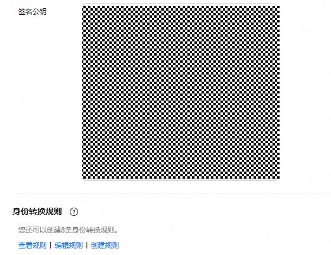
   
本文章节“[二. 创建ServiceAccount](#CreateSa)”中，在集群default命名空间下创建了一个名为oidc-token的ServiceAccount。


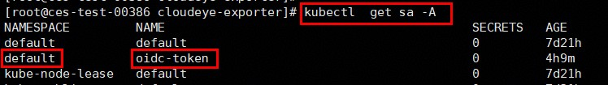

   为了将其映射到admin用户组（后续使用身份提供商ID访问云服务就具有admin用户组的权限），需要按照如下模板设置身份转换规则的生效条件：system:serviceaccount:{Namespace}:{ServiceAccountName}，如下图所示。
   
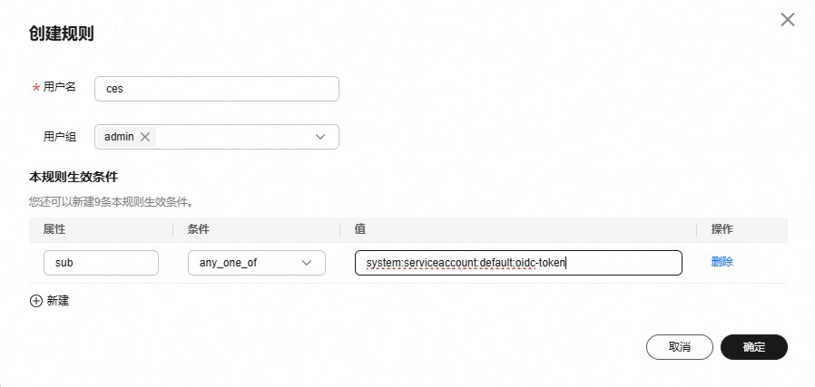

注：生效条件中**属性**字段必须为**sub**。

3. 点击“确定”，完成身份提供商配置。

## <a id="BuildAndPushImage">四. 构建并推送cloudeye-exporter镜像至华为云SWR服务</a>

1. 构建cloudeye-exporter镜像


在安装了docker的操作系统环境下，从Github华为云Cloudeye-Exporter开源站点下载最新软件包并解压至镜像构建路径，并创建docker构建文件Dockerfile，目录结构如下所示。
```
.
|-- Dockerfile
|-- cloudeye-exporter
|-- clouds.yml
|-- endpoints.yml
|-- i18n.json
|-- logs.yml
|-- metric.yml
|-- unit_standard_transform.json
```
以下为Dockerfile的构建内容示例。

```dockerfile
FROM alpine:latest

RUN mkdir -p /exporter

COPY cloudeye-exporter /exporter/
COPY endpoints.yml /exporter/
COPY clouds.yml /exporter/
COPY i18n.json /exporter/
COPY metric.yml /exporter/
COPY unit_standard_transform.json /exporter/
COPY logs.yml /exporter/

WORKDIR /exporter
RUN chmod +x ./cloudeye-exporter
CMD ["/exporter/cloudeye-exporter"]
```

执行构建命令，生成镜像。
```bash
docker build -t cloudeye-exporter:v1.0 .
```


2. 上传镜像至华为云SWR服务

执行以下命令，生成docker镜像离线包
```bash
docker save -o cloudeye-exporter.tar cloudeye-exporter:v1.0
```

将cloudeye-exporter.tar传送至CCE节点，并加载该离线包为CCE节点上的本地镜像
```bash
ctr images import cloudeye-exporter.tar
```

若您的CCE节点本身具备docker能力，则直接在CCE节点上构建本地镜像即可，不需要生成离线包。

登录华为云SWR控制台，按照以下图示获取CCE节点上的ctr镜像上传命令模板

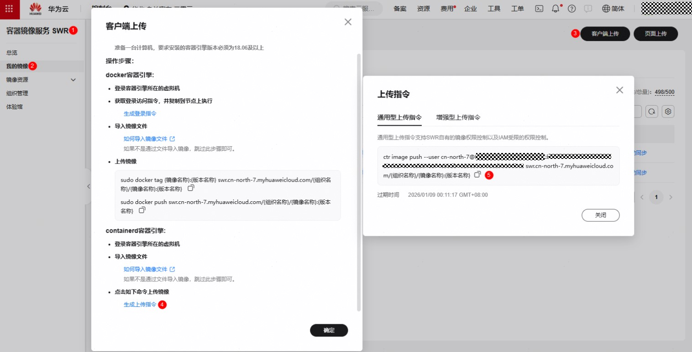

```
ctr image push --user cn-north-7@XXXXX:xxxxxxxxxxxxxxxxx swr.cn-north-7.myhuaweicloud.com/{组织名称}/{镜像名称}:{版本名称}
```
其中**swr.cn-north-7.myhuaweicloud.com/{组织名称}/{镜像名称}:{版本名称}** 为镜像tag。

目前cloudeye-exporter本地镜像的tag如下所示，不符合上传命令模板要求。

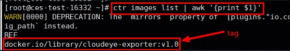

需要确定组织名称、镜像名称和版本名称后，为镜像打tag。

组织名称请按照以下示例图获取，本案例**组织名称**为**cloud-open**。

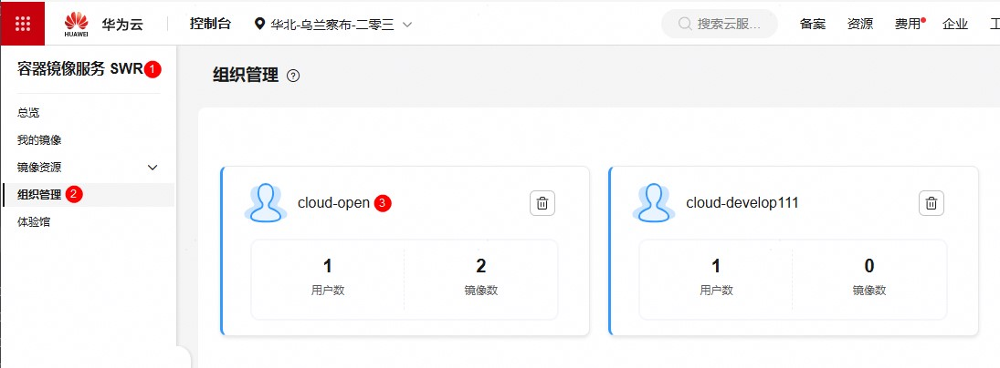

镜像名称和镜像版本由构建命令确定，本案例镜像名称为**cloudeye-exporter**，镜像版本为**v1.0**。

执行以下tag设置命令。
```bash
ctr images tag docker.io/library/cloudeye-exporter:v1.0  swr.cn-north-7.myhuaweicloud.com/cloud-open/cloudeye-exporter:v1.0
```

最终使用以下命令将镜像推送至SWR自有镜像仓库。
```bash
ctr image push --user cn-north-7@XXXXX:xxxxxxxxxxxxxxxxx swr.cn-north-7.myhuaweicloud.com/cloud-open/cloudeye-exporter:v1.0
```

推送完成后，会在“我的镜像”->“自有镜像”列表下显示该镜像。

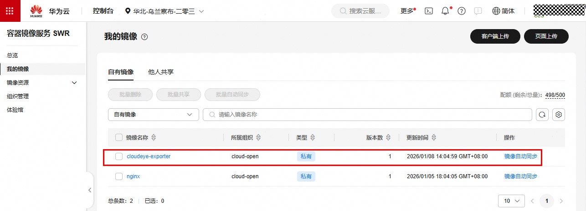

## <a id="CreateWorkLoad">五. 创建并运行有OIDC能力的cloudeye-exporter工作负载</a>

1. 导入主配置文件clouds.yml为ConfigMap

执行以下命令导入clouds.yml为ConfigMap
```bash
kubectl create configmap exporter-config --from-file=clouds.yml
```
clouds.yml的配置如下所示
```yaml
global:
  port: ":8087"
  prefix: "huaweicloud"
  scrape_batch_size: 300
  resource_sync_interval_minutes: 180
  ignore_ssl_verify: false
auth:
  auth_url: "https://iam.cn-north-7.myhuaweicloud.com/v3" # iam.cn-north-7.myhuaweicloud.com为当前region的iam服务域名
  project_name: "cn-north-7" # 华为云项目名称，可以在“华为云->统一身份认证服务->项目”中查看
  region: "cn-north-7" # 区域ID
  oidc:
    id_token_file_path: "/var/run/secrets/tokens/oidc-token" # 存放id_token的文件路径，在后续的工作负载配置yml中确定
    idp_id: ""  # 身份提供商ID，取值为“三. 在IAM创建身份提供商”下第2节中的身份提供商名称
    domain_id: ""  # 华为云账号ID
```
导入完成后的效果如下所示。

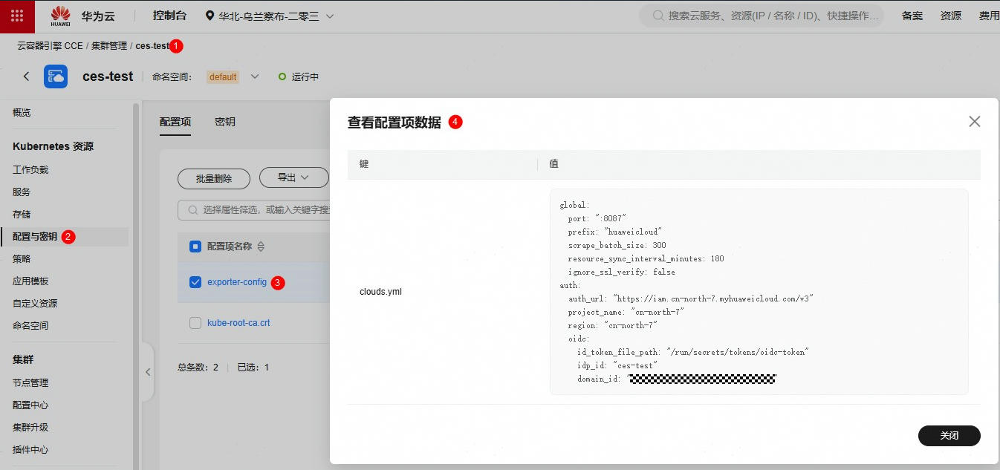

2. 创建cloudeye-exporter工作负载

需要挂载的工作负载**exporter-deploy.yaml**配置内容如下所示。
```yaml
apiVersion: apps/v1
kind: Deployment
metadata:
  name: cloudeye-exporter
spec:
  replicas: 1
  selector:
    matchLabels:
      app: cloudeye-exporter
      version: v1.0
  template:
    metadata:
      labels:
        app: cloudeye-exporter
        version: v1.0
    spec:
      containers:
      - name: container-1
        image: swr.cn-north-7.myhuaweicloud.com/cloud-open/cloudeye-exporter:v1.0  # 镜像推送至SWR时使用的tag
        command:
          - /exporter/cloudeye-exporter  # 启动命令
        args:
          - '-auth_mode'  # 启动参数
          - oidc  # 以oidc认证方式启动
        volumeMounts:
        - mountPath: "/var/run/secrets/tokens"  # 将Kubernetes生成的serviceAccountToken挂载到/var/run/secrets/tokens/oidc-token文件内
          name: oidc-token
        - mountPath: /exporter/clouds.yml  # 定义clouds.yml挂载路径
          name: exporter-config-volume  # 引用挂载卷
          subPath: clouds.yml  # subPath声明，防止覆盖其他文件而导致其不可访问
      imagePullSecrets:
      - name: default-secret
      serviceAccountName: oidc-token  # 章节“二. 创建ServiceAccount”中创建的ServiceAccount名称
      volumes:
      - name: oidc-token
        projected:
          defaultMode: 420
          sources:
          - serviceAccountToken:
              audience: ces-test   # 取值为，“三. 在IAM创建身份提供商”下第2节中的客户端ID
              expirationSeconds: 7200       # 过期时间
              path: oidc-token              # 路径名称，可自定义
      - name: exporter-config-volume # 获取clouds.yml主配置
        configMap:
          name: exporter-config
```

使用如下命令，将上述配置实例化为工作负载容器
```
kubectl  apply -f exporter-deploy.yaml
```

实例化完成后的效果。
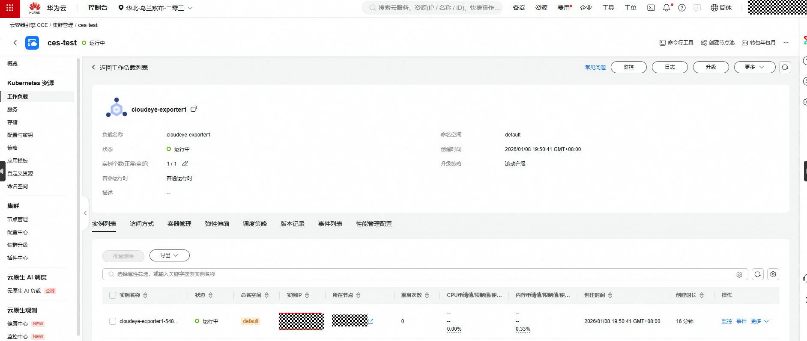

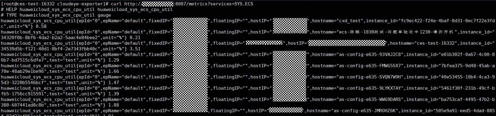