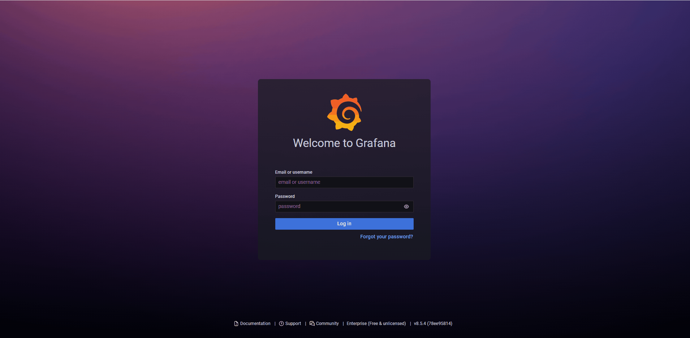
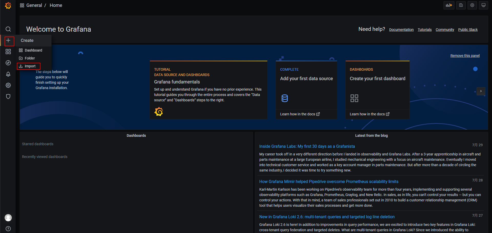
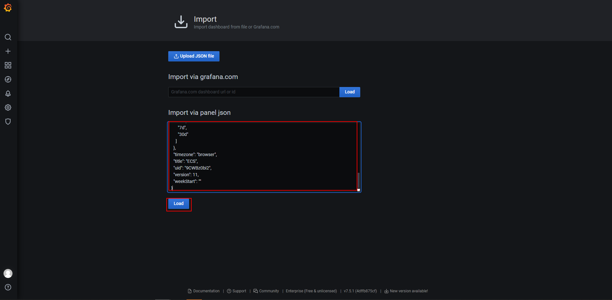
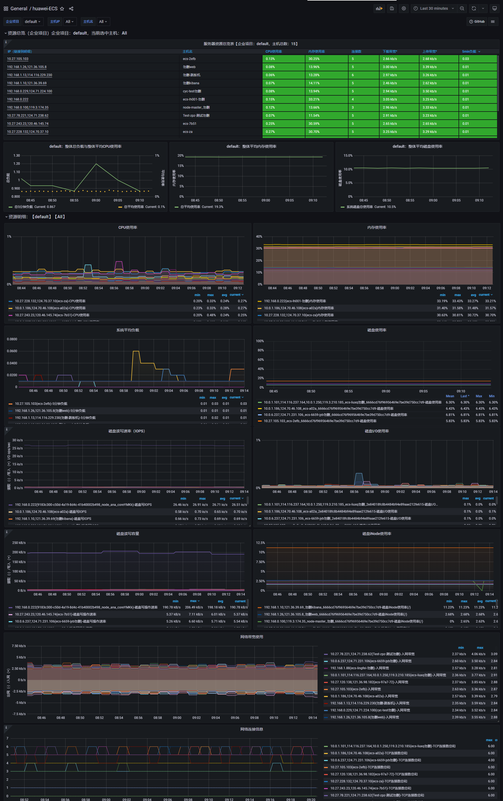

# Grafana监控面板使用
1. 下载Grafana (https://grafana.com/grafana/download)
   ```
   wget https://dl.grafana.com/enterprise/release/grafana-enterprise-9.0.5-1.x86_64.rpm
   sudo yum install grafana-enterprise-9.0.5-1.x86_64.rpm
   service grafana-server start
   ```
2. Grafana接入Prometheus数据源
   >(1) 登录Grafana
   >> 浏览器访问http://127.0.0.1:3000，登录
   >> 
   
   >(2) 配置Prometheus数据源
   >> Configuration—》Data source—》Add data source —》Prometheus —》填写Prometheus地址 —》保存&测试
   >> 
3. 配置相关云服务监控视图

   如果需要直接使用以下模板，需要修改prometheus配置，增加获取企业项目信息的任务，配置参考如下：
   ```
   $ vi prometheus.yml
   global:
     scrape_interval: 1m # Set the scrape interval to every 1 minute seconds. Default is every 1 minute.
     scrape_timeout: 1m
   scrape_configs:
     # 如果开启了企业项目，则配置该任务获取企业项目信息，用于模板
     - job_name: 'huaweicloud-eps'
       scheme: https # 默认该值为http，代表prometheus以http方式调用cloudeye-exporter，如需以https方式调用，请配置值改为https
       tls_config:   # prometheus以https调用cloudeye-exporter服务时，该参数必配
         ca_file: root.crt     # 客户端CA证书的路径
         cert_file: client.crt # 客户端https证书的路径
         key_file: client.key  # 客户端私钥的路径
       metrics_path: "/eps-info"
       static_configs:
       - targets: ['192.168.0.xx:8087']
   ```
   ><font size=6>+</font> —》Import —》输入json模板文件—》load
   >> 
   >> 
   
   **当前模板文件基于grafana10.x版本配置，10.x之前版本不再兼容适配，老版模板可使用grafana_dashboard/templates/old_version目录下取用。**
   
   **如遇grafana模板不兼容问题请升级grafana版本至10.x以上**
   
   **模板文件获取地址如下:**
   + [云搜索服务 CSS](templates/css(es)_dashboard_template.json)
   + [云搜索服务 Koosearch](templates/es_koosearch_template.json)
   + [云专线 DCAAS](templates/dcaas_dashboard_template.json)
   + [分布式缓存服务 DCS](templates/dcs_dashboard_template.json)
   + [弹性云服务器 ECS](templates/ecs_dashboard_template.json)
   + [弹性负载均衡 ELB](templates/elb_dashboard_template.json)
   + [关系型数据库 RDS](templates/rds_dashboard_template.json)
   + [关系型数据库 RDS(PostGreSQL)](templates/postgresql_dashboard_template.json)
   + [Web应用防火墙 WAF](templates/old_version/waf_dashboard_template.json)
   + [Web应用防火墙 WAF-独享引擎实例](templates/old_version/waf_premium_instance_dashboard_template.json)
   + [弹性公网IP和带宽 VPC](templates/vpc_dashboard_template.json)
   + [云防火墙 CFW](templates/cfw_dashboard_template.json)
   + [分布式消息服务 DMS-kafka](templates/dms(Kafka)_dashboard_template.json)
   + [分布式消息服务 DMS-RocketMQ](templates/dms_RocketMQ_dashboard_template.json)
   + [分布式消息服务 DMS-rabbitmq](templates/dms_rabbitmq-dashboard_template.json)
   + [云数据库 GeminiDB-cassandra](templates/nosql_cassandra_dashboard_template.json)
   + [DDOS高防 DDOS](templates/ddos_dashboard_template.json)
   + [内容分发网络 CDN](templates/cdn_dashboard_template.json)
   + [云硬盘 EVS](templates/evs_dashboard_template.json)
   + [云数据库 GaussDB(for MySQL)](templates/gaussdb(mysql)_dashboard_template.json)
   + [函数工作流 FunctionGraph](templates/functiongraph_dashboard_template.json)
   + [APIG网关专享版 APIC](templates/apic_dashboard_template.json)
   + [弹性伸缩 AS](templates/as_dashboard_template.json)
   + [云备份 CBR](templates/cbr_dashboard_template.json)
   + [云连接 CC](templates/cc_dashboard_template.json)
   + [数据湖探索 DLI](templates/dli_dashboard_template.json)
   + [数据复制服务 DRS](templates/drs_dashboard_template.json)
   + [云数据库 GaussDB](templates/gaussdbv5_dashboard_template.json)
   + [云数据库 GeminiDB Redis](templates/geminidb(redis)_dashboard_template.json)
   + [NAT网关 NAT](templates/nat_dashboard_template.json)
   + [广域网质量监控 WanQMonitor](templates/wanq_monitor_dashboard_template.json)
   + [视频直播 LIVE](templates/live_dashboard_template.json)
   + [云日志服务 LTS](templates/lts_dashboard_template.json)
   + [企业主机安全 HSS](templates/hss_dashboard_template.json)
   + [表格存储服务 CloudTable](templates/cloudtable_dashboard_template.json)
   + [云原生应用网络 ANC](templates/anc_dashboard_template.json)
   + [事件网格 EG](templates/eg_dashboard_template.json)
   + [对象存储服务 OBS](templates/obs_dashboard_template.json)
   + [云解析服务 DNS](templates/dns_dashboard_template.json)
   + [企业门户 EWP](templates/ewp_dashboard_template.json)
   + [企业路由器 ER](templates/er_dashboard_template.json)
   + [MaaS服务](templates/maas_dashboard_template.json)
   + [全域互联带宽](templates/gcb_dashboard_template.json)
   + [SFS Turbo (EFS)](templates/efs_dashboard_template.json)
   + [全域弹性公网IP和带宽](templates/geip_dashboard_template.json)
   + [分布式数据库中间件 DDM](templates/ddms_dashboard_template.json)
4. 效果展示：
   >ECS:
   > 
   